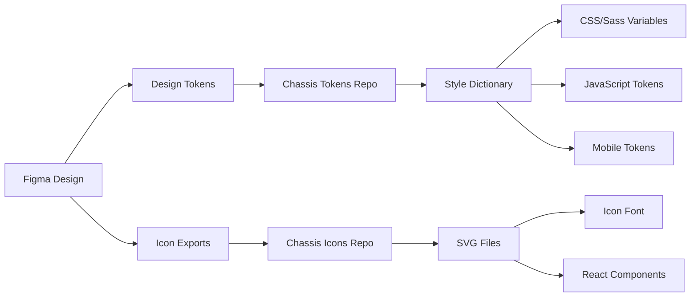

# Overview

Exporting assets from Chassis Figma involves more than extracting images and icons—it includes design token handoff, component specifications, and development-ready documentation. The system's token synchronization with Chassis Tokens, Chassis Assets, and Chassis Icons ensures consistency between design and implementation.

## Understanding the Export Ecosystem

### Chassis Asset Pipeline



The design system maintains bidirectional sync between design and code through automated token generation and export processes.

## Token Exports

### Design Tokens to Code

Chassis Figma variables sync bidirectionally with **Chassis Tokens** repository via **Tokens Studio plugin**:

**Bidirectional workflow**:

**Tokens → Figma** (Most common):
1. **Edit token files** in chassis-tokens Git repository
2. **Commit changes** to Git
3. **Pull in Tokens Studio** plugin (Figma)
4. **Push to Figma** to update Variables
5. **Designs update** automatically
6. **Publish library** to share with team

**Figma → Tokens** (When designing first):
1. **Edit variables** in Figma Variables panel
2. **Pull from Figma** in Tokens Studio plugin
3. **Commit to Git** repository
4. **Build process** generates platform files
5. **Development pulls** latest tokens

**Build process** (after tokens updated):
1. **Style Dictionary** transforms tokens to platform formats
2. **CSS/Sass variables** generated for web
3. **JavaScript/TypeScript** modules created
4. **Mobile platform** tokens (iOS/Android) generated

### Token Files Structure

```
chassis-tokens/
├── tokens/
│   ├── base/        # Primitive tokens
│   ├── semantic/    # Semantic layer
│   ├── component/   # Component-specific
│   └── applied/     # Context tokens
├── build/
│   ├── css/         # CSS custom properties
│   ├── scss/        # Sass variables
│   ├── js/          # JavaScript exports
│   └── mobile/      # iOS/Android formats
└── config.js        # Style Dictionary config
```

### Syncing Tokens with Tokens Studio

**Recommended workflow** (Git-connected):

1. **Open Tokens Studio plugin** in Figma
2. **Verify Git connection** (green status indicator)
3. **Pull from repository**:
   - Click "Pull from [Storage]" to fetch latest tokens
   - Review changes in plugin interface
4. **Push to Figma**:
   - Click "Push to Figma" to sync Variables
   - Wait for completion (1-3 minutes first time)
5. **Verify in Variables panel** (⌥⌘K or Alt+Ctrl+K)
6. **Publish library** if sharing with team

**Manual export** (when Git sync unavailable):

1. **Open Tokens Studio plugin**
2. **Export JSON**:
   - Click `Export` button in plugin
   - Choose "Export to JSON" format
   - Save to local directory
3. **Commit to tokens repository**:
   - Add files to chassis-tokens Git repo
   - Commit and push changes
4. **Run build process**:
   - `npm run build` in chassis-tokens
   - Generates platform-specific files

**Automation** (for CI/CD):

Set up automated token sync using GitHub Actions or similar CI/CD pipeline to continuously sync between Figma and code repositories.

### Reading Token Values

Developers reference token documentation:

**CSS usage**:
```css
.button-primary {
  background-color: var(--color-brand-primary);
  padding: var(--spacing-md) var(--spacing-lg);
  border-radius: var(--radius-md);
  font-family: var(--font-family-base);
}
```

**JavaScript usage**:
```javascript
import { colorBrandPrimary, spacingMd } from '@chassis/tokens';

const styles = {
  backgroundColor: colorBrandPrimary,
  padding: `${spacingMd}px`
};
```

## Icon Exports

### Exporting Icons from Figma

Icons are maintained in **Chassis Icons** file and exported to repository:

**Export process**:

1. **Select icon component** in Chassis Icons file
2. **Use export settings**:
   - Format: `SVG`
   - Size: `24x24` (default) or multiple sizes
   - Include: "id" attribute for accessibility
   - Optimize: Remove invisible elements
3. **Export to `icons/svg/` directory**
4. **Commit to Chassis Icons repository**
5. **Build process generates**:
   - Optimized SVG files
   - Icon font (webfont)
   - React components
   - Vue components

### Icon Export Settings

**Recommended Figma export configuration**:

```
Format: SVG
Size: 1x (designed at 24x24px)
Contents: Outline stroke (converted to fills)
Options:
  ✓ Include "id" attribute
  ✓ Outline text
  ✓ Simplify stroke
  ✗ Use absolute bounds (keep relative)
```

### Using Exported Icons

**HTML/CSS**:
```html
<i class="chassis-icon chassis-icon-arrow-right"></i>
```

**React**:
```jsx
import { IconArrowRight } from '@chassis/icons-react';

<IconArrowRight size={24} color="currentColor" />
```

**Direct SVG**:
```html
<svg width="24" height="24" viewBox="0 0 24 24">
  <path d="..." fill="currentColor"/>
</svg>
```

## Component Specifications

### Dev Mode Handoff

Figma's **Dev Mode** provides automated specifications:

**What developers see**:
- Component measurements and spacing
- Color values (with token names if linked)
- Typography specifications
- Assets ready for export
- Code snippets (platform-specific)

**To prepare designs for Dev Mode**:

1. **Name layers clearly** for developer understanding
2. **Link properties to variables** so token names appear
3. **Mark exportable assets** with export settings
4. **Use descriptive component names** matching code
5. **Add annotations** for complex interactions

### Creating Design Specs

For comprehensive handoff beyond Dev Mode:

**Specification document should include**:

1. **Component anatomy** - Labeled diagram of parts
2. **States and variants** - All interactive states
3. **Spacing and sizing** - Measurements with token names
4. **Typography** - Text styles and hierarchy
5. **Colors** - Token references, not hex values
6. **Interactions** - Hover, focus, active, disabled behaviors
7. **Responsive behavior** - Breakpoint adaptations
8. **Accessibility** - ARIA roles, keyboard navigation

### Spec Page Template

Create spec pages within Figma:

```
Component Spec Page
├── Visual Reference (actual component)
├── Anatomy Diagram (labeled parts)
├── Spacing Diagram (measurements)
├── States Grid (all variants)
├── Responsive Breakpoints
├── Accessibility Notes
└── Implementation Notes
```

**Use annotations plugin** or text for documentation.

## Image Asset Exports

### Exporting Images

For non-component visual assets (photos, illustrations):

**Export settings**:

```
Format options:
  PNG   - For images with transparency
  JPG   - For photographs
  SVG   - For vector illustrations
  WebP  - For modern web optimization

Size considerations:
  @1x - Standard resolution
  @2x - Retina displays
  @3x - High-DPI mobile devices
```

**Export workflow**:

1. **Select image layer/frame**
2. **Add export settings** in right panel
3. **Configure format and size**
4. **Name with convention**: `component-variant-size@2x.png`
5. **Export selected** or use batch export
6. **Optimize images** before committing (use ImageOptim, Squoosh)

### Image Naming Conventions

```
Format: [component]-[variant]-[context]@[resolution].[ext]

Examples:
  hero-image-homepage@2x.jpg
  avatar-placeholder-light@1x.png
  illustration-onboarding-step1@2x.svg
  icon-logo-full-color.svg
```

### Optimization Best Practices

✅ **Compress images** before adding to repository
✅ **Use appropriate formats** (PNG for transparency, JPG for photos)
✅ **Provide multiple resolutions** (@1x, @2x, @3x)
✅ **Consider WebP** for modern browsers with fallbacks
✅ **Optimize SVGs** (remove unnecessary metadata)
✅ **Document image specs** (dimensions, usage context)

## Prototypes and Interactions

### Exporting Prototypes

For interactive demonstrations and user testing:

**Figma prototype sharing**:

1. **Click Share** button (top-right)
2. **Choose permissions**:
   - `Can view` - For stakeholders
   - `Can edit` - For design team
3. **Enable prototype mode** in share settings
4. **Copy link** and share
5. **Set password** if confidential

**Prototype export**:
- **Present via Figma**: Share prototype link
- **Record video**: Use screen recording for demos
- **Export frames**: For static documentation
- **Code generation**: Use tools like Anima, Figma to Code

### Documenting Interactions

For developers implementing interactions:

**Interaction spec should include**:

1. **Trigger**: What initiates the interaction (click, hover, scroll)
2. **Animation**: Duration, easing, properties animated
3. **Destination**: Where user navigates or what changes
4. **Conditions**: When interaction is available/disabled
5. **Feedback**: Visual/haptic/audio response

**Example interaction spec**:

```
Interaction: Button Click
  Trigger: onClick event
  States:
    Hover:
      - Background: Darken 10%
      - Transition: 200ms ease-in-out
    Active:
      - Scale: 0.98
      - Transition: 100ms ease-out
    Focus:
      - Outline: 2px solid focus ring
      - Outline offset: 2px
  Action: Submit form / Navigate to [page]
```

## Handoff Best Practices

### Designer Responsibilities

**Before handoff**:

✅ **Update all components** to latest library version
✅ **Link all properties** to variables/tokens
✅ **Name layers clearly** and consistently
✅ **Mark export settings** for all assets
✅ **Create spec pages** for complex components
✅ **Annotate interactions** and edge cases
✅ **Test in Dev Mode** to verify token references
✅ **Review with team** before declaring "ready"

### Developer Handoff Checklist

**Provide to developers**:

- [ ] **Figma file link** with view access
- [ ] **Dev Mode enabled** for the file
- [ ] **Token documentation** with mapping to code
- [ ] **Component specs** for complex elements
- [ ] **Asset exports** (icons, images) committed to repository
- [ ] **Prototype links** for interaction reference
- [ ] **Accessibility notes** (ARIA, keyboard navigation)
- [ ] **Testing criteria** (responsive, browser support)
- [ ] **Contact info** for design questions

### Communication Tools

**Effective handoff channels**:

- **Figma comments**: For specific design questions
- **Slack/Teams channels**: For ongoing discussion
- **Jira/Linear tickets**: For implementation tracking
- **Confluence/Notion**: For detailed documentation
- **Design system site**: For self-service reference
- **Office hours**: Regular sync meetings

## Automated Export Workflows

### CI/CD Integration

For production-grade token and asset synchronization:

**GitHub Actions workflow example**:

```yaml
name: Export Tokens

on:
  push:
    branches: [main]

jobs:
  export-tokens:
    runs-on: ubuntu-latest
    steps:
      - uses: actions/checkout@v3
      - name: Export Figma Variables
        uses: figma/figma-export-action@v1
        with:
          figma-token: ${{ secrets.FIGMA_TOKEN }}
          file-key: ${{ secrets.FIGMA_FILE_KEY }}
      - name: Build Tokens
        run: npm run build:tokens
      - name: Commit Changes
        run: |
          git config user.name "GitHub Actions"
          git commit -am "Update tokens from Figma"
          git push
```

### Figma API Integration

For custom export automation:

**Using Figma REST API**:

```javascript
const fetch = require('node-fetch');

async function exportFromFigma() {
  const response = await fetch(
    `https://api.figma.com/v1/files/${fileKey}`,
    {
      headers: {
        'X-Figma-Token': process.env.FIGMA_TOKEN
      }
    }
  );

  const data = await response.json();
  // Process components, variables, etc.
}
```

**Use cases**:
- Automated icon exports on library update
- Token synchronization on schedule
- Screenshot generation for documentation
- Component inventory generation

## Version Control for Exports

### Managing Export Versions

**Git workflow for assets**:

```
feature/button-redesign
  ├── Update button component in Figma
  ├── Export updated tokens
  ├── Export button assets (if any)
  ├── Update documentation
  ├── Commit to branch
  └── Create PR for review
```

### Semantic Versioning

Match Figma library versions to token/asset releases:

```
v2.5.0 - Figma library published
  ↓
chassis-tokens@2.5.0
chassis-icons@2.5.0
chassis-css@2.5.0
```

**Version strategy**:
- **Major (v3.0.0)**: Breaking changes, component removals
- **Minor (v2.5.0)**: New components, non-breaking additions
- **Patch (v2.4.1)**: Bug fixes, token adjustments

## Troubleshooting Exports

### Missing Token References

**Problem**: Exported design shows hex values instead of token names

**Solutions**:
- Ensure properties use variables, not direct values
- Publish variable collections before exporting
- Update components to latest library version
- Check variable scopes are properly set

### Icon Export Issues

**Problem**: Exported SVG includes unnecessary code or doesn't scale properly

**Solutions**:
- Use "Outline stroke" before exporting
- Flatten layers that don't need to be separate
- Set appropriate viewBox (0 0 24 24)
- Remove fixed width/height attributes
- Validate with SVGO optimizer

### Large File Sizes

**Problem**: Exported assets are too large for web performance

**Solutions**:
- Compress images with ImageOptim, Squoosh, TinyPNG
- Use WebP format with fallbacks
- Implement lazy loading for images
- Consider SVG optimization (SVGOMG)
- Sprite sheets for multiple icons

### Dev Mode Not Showing Tokens

**Problem**: Developers see pixel values instead of token names

**Solutions**:
- Link component properties to variables
- Publish variable collections to library
- Enable Dev Mode for the file
- Ensure developers have latest library enabled

## Next Steps

- **[Updating the Library](./updating-the-library)** - Version management and updates
- **[Variables & Styles](../getting-started/variables-styles)** - Token system architecture
- **[Component Assets](../getting-started/component-assets)** - Asset-based components
- **[Library Setup](../getting-started/library-setup)** - Publishing and team access

## Resources

- **Figma Dev Mode**: [help.figma.com/dev-mode](https://help.figma.com/hc/en-us/categories/360003920473-Dev-Mode)
- **Figma API**: [figma.com/developers/api](https://www.figma.com/developers/api)
- **Style Dictionary**: [amzn.github.io/style-dictionary](https://amzn.github.io/style-dictionary/)
- **SVGOMG Optimizer**: [jakearchibald.github.io/svgomg](https://jakearchibald.github.io/svgomg/)
- **Chassis Tokens**: GitHub repository for design tokens
- **Chassis Icons**: GitHub repository for icon system
