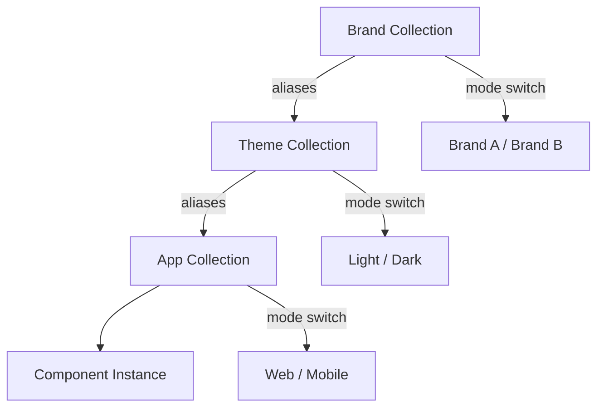

# Overview

Chassis Figma's tokenized architecture enables seamless theme switching across entire designs with a single click. Built on Figma's variables and modes system, you can design for multiple brands, color schemes (light/dark), or product lines simultaneously while maintaining a single source of truth for all components.

## Understanding Theme Architecture

### Variable-Based Theming

Chassis uses **Tokens Studio plugin** to sync design tokens from the Git repository to **Figma Variable Collections** with multiple **Modes**:

```
Variable Collection: Brand
  ├── Mode: Brand A (default)
  ├── Mode: Brand B
  └── Mode: Brand C

Variable Collection: Theme
  ├── Mode: Light (default)
  ├── Mode: Dark
  └── Mode: High Contrast

Variable Collection: App
  ├── Mode: Web (default)
  ├── Mode: Mobile
  └── Mode: Tablet
```

Each mode contains unique values for the same variable names, allowing instant switching without changing component structure.

### Theme Hierarchy

**Token aliasing** creates the theming system:



Components reference App/Theme tokens, which alias Brand tokens. Switching modes changes resolved values.

## Built-in Themes

### Brand Collection Modes

**Purpose**: Foundation colors, typography, and border radius for each brand

**Available Modes**:
- Brand A (default)
- Brand B
- Brand C (if configured)

**Switching brands**:
1. Select frame or component
2. Open `Variables` panel (right sidebar)
3. Click mode dropdown under `Brand` collection
4. Choose brand mode
5. All Theme and App tokens automatically resolve to brand values

### Theme Collection Modes

**Purpose**: Color mode variations (light/dark themes)

#### Light Mode (Default)
- High contrast for readability
- Bright backgrounds with dark text
- Optimized for daytime use
- Standard for most applications

#### Dark Mode
- Reduced eye strain in low light
- Dark backgrounds with light text
- Popular for night use
- Accessibility consideration for sensitivity

#### High Contrast (Optional)
- Enhanced contrast ratios
- Accessibility-focused
- WCAG AAA compliance

**Switching between Light/Dark**:
1. Select frame or component
2. Open `Variables` panel (right sidebar)
3. Click mode dropdown under `Theme` collection
4. Choose `Light`, `Dark`, or `High Contrast` mode

### App Collection Modes

**Purpose**: Platform-specific sizing, spacing, and component variations

#### Web (Default)
- Desktop-optimized spacing
- Larger touch targets acceptable
- Standard component sizing

#### Mobile
- Tighter spacing for smaller screens
- Minimum 44px touch targets
- Compact component variants

#### Tablet
- Balanced between web and mobile
- Adaptive layout behaviors

**Switching between platforms**:
1. Select frame or component
2. Open `Variables` panel
3. Change mode under `App` collection
4. Choose `Web`, `Mobile`, or `Tablet`

## Switching Themes

### Frame-Level Switching

Apply themes to entire pages or screens:

1. **Select top-level frame** (page/screen)
2. **Open Variables panel** (right sidebar)
3. **Change mode** for each collection:
   - Color collection → `Dark`
   - Spacing collection → `Compact`
4. **All nested components update** instantly

### Component-Level Switching

Override theme for specific components:

1. **Select component instance**
2. **Open Variables panel**
3. **Change mode** independently from parent frame
4. **Component diverges** from parent theme

**Use case**: Light component on dark background, or vice versa.

### Mode-Based Visibility

Chassis includes special **switch variables** for controlling element visibility based on active mode:

**Switch Variables**:
```
figma/switch/brand/mode-1   → True when Brand A active
figma/switch/brand/mode-2   → True when Brand B active
figma/switch/theme/mode-1   → True when Light mode active
figma/switch/theme/mode-2   → True when Dark mode active
figma/switch/app/mode-1     → True when Web mode active
figma/switch/app/mode-2     → True when Mobile mode active
```

**Example - Brand-specific logos**:
```
Header Component
├─ Brand A Logo → Visibility: figma/switch/brand/mode-1
└─ Brand B Logo → Visibility: figma/switch/brand/mode-2
```

**Example - Combined switches for logo + theme**:
```
Header Component
├─ Brand A Logo Group     → Visibility: figma/switch/brand/mode-1
│  ├─ logo-a-light (Image) → Visibility: figma/switch/theme/mode-1
│  └─ logo-a-dark (Image)  → Visibility: figma/switch/theme/mode-2
└─ Brand B Logo Group     → Visibility: figma/switch/brand/mode-2
   ├─ logo-b-light (Image) → Visibility: figma/switch/theme/mode-1
   └─ logo-b-dark (Image)  → Visibility: figma/switch/theme/mode-2
```

This enables structural changes (not just styling) when switching modes.

### Layer-Level Switching

For granular control:

1. **Select specific layer** within component
2. **Open Variables panel**
3. **Override variable value** directly
4. **Maintains connection** to variable system

## Designing for Multiple Themes

### Theme-First Design Approach

**Design in all modes from the start**:

1. **Create initial design** in default mode (Light + Comfortable)
2. **Switch to Dark mode** and verify contrast/readability
3. **Switch to Compact mode** and check spacing/alignment
4. **Iterate in both** modes simultaneously
5. **Document theme-specific** decisions

### Theme Testing Workflow

**Systematic validation**:

```
For each design/page:
  ├── Test Light mode
  │   ├── Check contrast ratios
  │   ├── Verify hierarchy
  │   └── Validate interactions
  ├── Test Dark mode
  │   ├── Check contrast ratios
  │   ├── Verify readability
  │   └── Validate subtle elements
  └── Test Compact mode
      ├── Check touch targets (44px min)
      ├── Verify content doesn't overflow
      └── Validate spacing consistency
```

### Theme-Specific Considerations

#### Dark Mode Design

**Special attention needed**:

✅ **Increase surface elevation** - Use shadow/glow for depth
✅ **Reduce pure white** - Use off-white (#F5F5F5) to reduce eye strain
✅ **Adjust image brightness** - Photos may appear too bright
✅ **Test color accessibility** - Some colors need adjustment for contrast
✅ **Validate form inputs** - Ensure input fields are clearly visible

❌ **Don't pure invert** - Colors have different perceptual brightness
❌ **Don't ignore elevation** - Depth perception is critical in dark mode
❌ **Don't forget focus states** - Must be visible against dark backgrounds

#### Compact Mode Design

**Spacing considerations**:

✅ **Maintain touch targets** - Minimum 44x44px for mobile
✅ **Preserve readability** - Don't sacrifice legibility for density
✅ **Test with real content** - Long labels may overflow
✅ **Verify scrolling** - More content = more scrolling
✅ **Check responsive behavior** - Compact may need different breakpoints

❌ **Don't compress below minimums** - Respect accessibility guidelines
❌ **Don't remove necessary whitespace** - Some breathing room required
❌ **Don't break hierarchy** - Visual organization still matters

## Creating Custom Themes

### Adding New Modes via Tokens Studio

Custom modes are created in the chassis-tokens repository and synced to Figma:

**Workflow**:

1. **Create token files** in chassis-tokens repository:
   ```
   tokens/
   ├── brand-a.json     (existing)
   ├── brand-b.json     (existing)
   └── brand-c.json     (new mode)
   ```

2. **Define token values** for new mode following existing structure

3. **Configure theme options** in Tokens Studio settings:
   ```json
   {
     "Brand": ["Brand A", "Brand B", "Brand C"]
   }
   ```

4. **Pull tokens** in Tokens Studio plugin (Pull from storage)

5. **Push to Figma** to create new mode in Brand collection

6. **Test new mode** across component library

7. **Publish library** to share with team

### Defining Brand-Specific Values

**Token structure in chassis-tokens repository**:

```
Variable: color/semantic/brand/primary
  ├── Light mode: #0066CC (Brand A blue)
  ├── Dark mode: #4D94FF (Brand A light blue)
  ├── Brand B - Light: #00A86B (Brand B green)
  └── Brand B - Dark: #33CC99 (Brand B light green)
```

**Typography variable examples**:

```
Variable: typography/font-family/brand
  ├── Brand A: "Inter", sans-serif
  └── Brand B: "Roboto", sans-serif
```

### Publishing Custom Themes

**Process**:

1. **Commit token files** to chassis-tokens Git repository
2. **Pull latest** in Tokens Studio plugin
3. **Push to Figma** to sync new mode values
4. **Test theme** across all component documentation pages
5. **Configure publishing settings**:
   - Hide base tokens if needed
   - Set appropriate variable scopes
6. **Document theme purpose** in library description
7. **Publish library update** with new mode available
8. **Notify team** via Slack/email with usage guidelines
9. **Provide examples** showing new theme in use

### Synchronizing with Development

When adding custom themes, coordinate with development team:

**Design → Code workflow**:
```
1. Designer: Create token files in chassis-tokens repo
2. Designer: Sync to Figma via Tokens Studio
3. Developer: Pull same token files
4. Developer: Build with Style Dictionary
5. Developer: CSS/JS tokens match Figma exactly
6. Both: Test parity between design and code
```

## Multi-Theme Handoff

### Development Communication

**Variable mode mapping**:

```json
{
  "themes": {
    "light": "Light mode",
    "dark": "Dark mode",
    "compact": "Compact spacing mode",
    "comfortable": "Comfortable spacing mode"
  },
  "implementation": {
    "light": "Default CSS, no class",
    "dark": "Apply .dark or data-theme='dark'",
    "compact": "Apply .density-compact",
    "comfortable": "Default spacing"
  }
}
```

### Exporting Multi-Theme Designs

**Documenting all variants**:

1. **Create artboard per theme**:
   - Page_Light
   - Page_Dark
   - Page_Light_Compact
   - Page_Dark_Compact

2. **Export each version** for developer reference

3. **Annotate theme-specific behaviors**:
   - Dynamic vs. static theming
   - User preference persistence
   - System preference detection

4. **Provide token mapping** from Figma variables to code

## Theme Best Practices

### Do's

✅ **Design in both modes** from the beginning
✅ **Test accessibility** in all themes (WCAG 2.1 AA)
✅ **Use semantic tokens** not primitive values
✅ **Document theme-specific decisions** for developers
✅ **Provide theme toggle** in prototypes for testing
✅ **Validate across devices** and contexts
✅ **Consider user preferences** (system, saved, manual)

### Don'ts

❌ **Don't design only in light mode** then "fix" dark mode
❌ **Don't hardcode colors** that should be variable-driven
❌ **Don't assume perfect symmetry** between themes
❌ **Don't ignore theme-specific edge cases**
❌ **Don't forget loading/error states** in all themes
❌ **Don't skip theme testing** in design reviews
❌ **Don't publish without theme compatibility**

## Troubleshooting Themes

### Theme Not Switching

**Problem**: Selected mode doesn't change appearance

**Solutions**:
- Ensure component uses variables, not hardcoded values
- Check parent frame mode isn't overriding
- Verify variable collection is published
- Restart Figma if variables seem cached

### Inconsistent Theme Application

**Problem**: Some components update, others don't

**Solutions**:
- Update all library components to latest version
- Check for detached instances (lost variable connections)
- Verify all nested components reference variables
- Audit for hardcoded overrides on instances

### Theme-Specific Visual Bugs

**Problem**: Layout breaks or looks wrong in certain mode

**Solutions**:
- Review mode-specific variable values
- Check component auto-layout behavior with new values
- Verify font weights/sizes are appropriate for theme
- Test with realistic content length variations

### Dark Mode Contrast Issues

**Problem**: Text or elements not visible in dark mode

**Solutions**:
- Check WCAG contrast ratios (use plugins like Contrast)
- Adjust semantic color token values for dark mode
- Verify surface colors provide sufficient elevation
- Test with colorblind simulation tools

## Advanced Theme Techniques

### Nested Mode Overrides

**Use different modes within same frame**:

```
Page Frame (Dark mode)
├── Header (Dark mode - inherited)
├── Hero Section (Light mode - override)
├── Content Section (Dark mode - inherited)
└── Footer (Dark mode - inherited)
```

**Application**: Landing pages with mixed-mode sections for visual impact.

### Conditional Theme Logic

**Document theme-dependent behaviors**:

- Show/hide elements based on theme
- Adjust image opacity in dark mode
- Change icons for better contrast
- Modify spacing for compact mode

**Implementation**: Use variants with naming convention for developer parsing.

### Theme Animation

**Designing theme transitions**:

1. **Document duration**: 200-300ms typical
2. **Specify easing**: `ease-in-out` for smooth transitions
3. **Identify animated properties**: colors, backgrounds, borders
4. **Note exceptions**: Images, complex elements may not animate

## Next Steps

- **[Exporting Assets](./exporting-assets)** - Export multi-theme assets
- **[Working with Templates](./working-with-templates)** - Apply themes to templates
- **[Variables & Styles](../getting-started/variables-styles)** - Deep dive into tokens
- **[Component Assets](../getting-started/component-assets)** - Theme-aware asset system

## Resources

- **Variables Documentation**: [help.figma.com/variables](https://help.figma.com/hc/en-us/articles/15339657135383-Guide-to-variables-in-Figma)
- **Dark Mode Guide**: [material.io/dark-theme](https://material.io/design/color/dark-theme.html)
- **WCAG Contrast**: [webaim.org/contrast](https://webaim.org/resources/contrastchecker/)
- **Chassis Tokens Reference**: `/docs/tokens` (token values for all modes)
