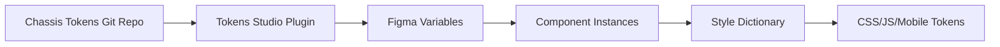

# Overview

Chassis Figma leverages Figma's variables and styles system to create a fully tokenized design system that stays in perfect sync with production code. Every color, spacing value, typography setting, and effect in Chassis is defined as a token, enabling instant theme switching, brand adaptation, and guaranteed design-to-code consistency.

## Design Tokens Architecture

### Token Hierarchy

Chassis uses a four-tier token system:

```
Base Tokens (Primitives)
    ↓ Reference
Semantic Tokens (Purpose)
    ↓ Reference
Component Tokens (Specific)
    ↓ Referenced by
Components & Styles
```

#### 1. Base Tokens (Primitives)

Foundation values with no semantic meaning.

**Examples**:
- `color.base.palette.blue.500` → `#1273E0`
- `spacing.base.4` → `16px`
- `font.family.sans` → `"Inter"`

**Use**: Building blocks for semantic tokens

#### 2. Semantic Tokens

Purpose-driven tokens referencing base tokens.

**Examples**:
- `color.semantic.primary.base` → `{color.base.palette.blue.500}`
- `spacing.semantic.gap.medium` → `{spacing.base.4}`
- `typography.semantic.body.regular` → `{font.family.sans}`

**Use**: Design intent, theme-switchable values

#### 3. Component Tokens

Component-specific tokens for granular control.

**Examples**:
- `button.color.primary.background` → `{color.semantic.primary.base}`
- `card.spacing.padding` → `{spacing.semantic.gap.medium}`
- `accordion.typography.title` → `{typography.semantic.heading.small}`

**Use**: Fine-tune individual components

#### 4. Applied in Components

Components reference tokens through variables and styles.

**Example - Button Component**:
```
Fill → Variable: button.color.primary.background
Text → Style: button.typography.label
Padding → Variable: button.spacing.padding.horizontal
```

## Sync with Chassis Tokens

Chassis Figma variables are synchronized bidirectionally with the [Chassis Tokens](https://github.com/chassis-ui/tokens) repository using **Tokens Studio plugin**, ensuring perfect design-code parity.

### Tokens Studio Plugin

**Tokens Studio** is the bridge between your Git repository and Figma Variables:

- **Pull from Git**: Fetch latest token definitions from chassis-tokens repository
- **Push to Figma**: Sync tokens as native Figma Variables with proper collections and modes
- **Two-way Sync**: Changes in either direction stay synchronized
- **Real-time Updates**: Designs using variables update automatically

### Token Sync Process



### Syncing Workflow

**Initial setup** (one-time):

1. **Install Tokens Studio**: Plugins → Browse plugins → Install "Tokens Studio"
2. **Configure Git Storage**: In plugin, connect to chassis-tokens repository
3. **Pull Tokens**: Click "Pull from [Storage]" to fetch token definitions
4. **Export to Figma**: Open "Styles & Variables" → "Export Styles & Variables To Figma"
5. **Select Theme Options**: Choose which theme combinations to sync (Brand, Theme, App)
6. **Publish Library**: Share updated variables with team

**Updating tokens**:

1. **Pull Changes**: In Tokens Studio, click "Pull from [Storage]"
2. **Review Diff**: Plugin shows which tokens changed
3. **Push to Figma**: Click "Push to Figma" to update Variable values
4. **Automatic Update**: All designs using variables update instantly
5. **Publish Library**: Share updates with team

### Staying in Sync

**Best practices**:
- ✅ Pull latest tokens before starting design work
- ✅ Sync regularly (weekly minimum for active projects)
- ✅ Coordinate token updates with development team
- ✅ Test designs after token updates
- ✅ Publish library immediately after syncing

### Version Matching

Chassis Figma versions match token versions:

```
Chassis Tokens v0.1.0
    ↓ synchronized with
Chassis Figma v0.1.0
```

Always use matching versions to ensure consistency.

## Variable Collections

Chassis Tokens uses **Theme Groups** which map to **Variable Collections** in Figma. Each collection can have multiple **Modes** (from Theme Options).

### Collection Structure

```
Theme Groups → Variable Collections
Theme Options → Variable Modes
```

### Brand Collection

**Purpose**: Foundation colors, typography, and border radius (not directly used in design)

**Contents**:
- `color.base.*` - Base color palette
- `borderRadius.base.*` - Base border radius values
- Font family definitions

**Modes**: Different brand identities (Brand A, Brand B, etc.)

**Usage**: Serves as source for Theme and App collections through token aliasing

**Publishing**: Most base tokens should be **hidden from publishing** to reduce clutter

### Theme Collection

**Purpose**: Palette, context, and shadow colors for actual design use

**Contents**:
- `color.palette.*` - Semantic color palette
- `color.context.*` - Context-specific colors (primary, success, danger, etc.)
- `color.shadow.*` - Shadow and elevation colors

**Modes**: Color mode variations
- Light (default)
- Dark
- High Contrast (optional)

**Usage**: Primary collection for applying colors in designs

**Token Aliasing**: Theme tokens reference Brand collection colors, adapting them per mode:
```
color/context/primary/bg-idle (Theme Collection)
  ↓ aliases to
color/base/context/[theme-mode]/primary/bg-idle (Brand Collection)
```

### App Collection

**Purpose**: Component-specific variables plus general sizing, spacing, and borders

**Contents**:
- `size.*` - Width and height values
- `space.*` - Spacing and gap values
- `borderWidth.*` - Border stroke widths
- `borderRadius.*` - Corner radius values
- Component-specific tokens (button, card, input, etc.)

**Modes**: Platform or context variations
- Web (default)
- Mobile
- Tablet

**Usage**: Primary collection for layout, spacing, and component styling

### Mode-Based Visibility

Chassis includes special **switch variables** for controlling element visibility based on active mode:

**Example variables**:
```
figma/switch/brand/mode-1   → True when Brand A active, False otherwise
figma/switch/brand/mode-2   → True when Brand B active, False otherwise
figma/switch/theme/mode-1   → True when Light mode active, False otherwise
figma/switch/theme/mode-2   → True when Dark mode active, False otherwise
```

**Usage**: Apply to layer visibility to show/hide elements per theme:
```
Header Logo Group
├─ Brand A Logo → Visibility: figma/switch/brand/mode-1
└─ Brand B Logo → Visibility: figma/switch/brand/mode-2
```

This enables structural changes (not just styling) when switching modes.

## Publish & Scope Settings

### Hide from Publishing

Some variables have no direct use in design and should be hidden to reduce clutter:

**Recommended to hide**:
- `color.base.*` - Base colors (use Theme collection instead)
- `borderRadius.base.*` - Base border radii (use App collection instead)

**To hide variables**:
1. Select variables in Variables panel
2. Click \"Edit variable\"
3. Check \"Hide from publishing\" option
4. Variables remain for reference but won't appear in property dropdowns

### Variable Scopes

Set appropriate scopes so variables only appear in relevant property dropdowns:

**Recommended scopes**:
```
size.*                → Width & Height
space.*               → Gap (Auto layout)
borderRadius.*        → Corner radius
borderWidth.*         → Stroke
opacity.*             → Layer opacity
fontSize.*            → Font size, Width & Height (for skeleton placeholders)
lineHeight.*          → Line height, Width & Height (for skeleton placeholders)
fontWeight.*          → Font weight
```

**To set scopes**:
1. Select variables in Variables panel
2. Click \"Edit variable\"
3. Click \"Scope\" tab
4. Check appropriate scope options

### Publishing Strategy

**Recommended approach**:

1. **Sync latest tokens** from Tokens Studio (Pull → Push to Figma)
2. **Configure publishing** (hide base tokens, set scopes)
3. **Review collections and modes**
4. **Publish library** to make variables available to team
5. **Team files update** with new/changed variables

**What to publish**:
```
✅ Theme Collection (all modes)
✅ App Collection (all modes)
✅ Brand Collection (but hide base tokens)
✅ Switch variables (figma/switch/*)
```

**What to hide from publishing**:
```
❌ color.base.* (foundation colors)
❌ borderRadius.base.* (foundation radii)
```

**Reasoning**:
- Designers work with semantic tokens (Theme/App), not primitives
- Reduces variable clutter in property dropdowns
- Maintains token system integrity
- Brand collection still available for advanced use

### Library Dependencies

Variables should be in the same library files as components:

```
Component Library Files
├── Contains: Components + Variables
└── Published as: Single library

Design Project Files
└── Consume: Components with variables embedded
```

This ensures all components have access to the variables they need.

## Style Guide Pages

Built-in documentation within the Figma library files.

### What's Included

#### Color Guide
- All color tokens with swatches
- Usage guidelines per color
- Accessibility contrast ratios
- Theme comparison views

#### Typography

 Guide
- All text styles with samples
- Character/paragraph settings
- Line length recommendations
- Hierarchy demonstrations

#### Spacing Guide
- Visual spacing scale
- Layout grid examples
- Component spacing patterns
- Responsive spacing rules

#### Component Guide
- Usage examples for each component
- Do's and don'ts illustrations
- State variations
- Responsive behaviors

### Accessing Style Guides

1. Open **Chassis Library file**
2. Navigate to **📖 Style Guide** page
3. Browse by category
4. Reference samples in your designs

### Custom Style Guides

Create project-specific guides:

1. Duplicate Style Guide page template
2. Replace with project-specific examples
3. Add project context and requirements
4. Share with team as reference

## Working with Variables

### Applying Variables

#### To Fill/Stroke
1. Select layer
2. Click color swatch
3. Choose **"Variable"** from menu
4. Select appropriate token

#### To Auto-layout
1. Select auto-layout frame
2. In properties panel, click value field
3. Click variable icon (◈)
4. Choose spacing token

#### To Effects
1. Select layer with effect
2. Edit effect settings
3. Link values to variables
4. Configure per theme mode

### Creating Variable Aliases

Link one variable to another (token referencing):

1. Edit variable in Variables panel
2. Change value from fixed to variable
3. Select source variable
4. Save alias relationship

This creates the token hierarchy (e.g., semantic → base).

### Mode Switching

Test designs across themes:

1. Select frame/page
2. Click **Variable mode** dropdown (top right)
3. Choose theme (Light/Dark/etc.)
4. Design updates live

**Tip**: Create test pages with all themes side-by-side.

## Best Practices

### Do's

✅ **Use semantic tokens** in designs, not base tokens
✅ **Test across all modes** before finalizing
✅ **Document custom variables** with clear descriptions
✅ **Follow naming conventions** for consistency
✅ **Keep variables in sync** with token repository
✅ **Use variable collections** to organize related tokens

### Don'ts

❌ **Don't hardcode values** that should be tokenized
❌ **Don't create duplicate variables** for same value
❌ **Don't skip variable testing** across themes
❌ **Don't override variables** without team discussion
❌ **Don't publish untested variables** to production
❌ **Don't break token hierarchy** with direct references

## Troubleshooting

### Variables Not Showing

**Symptom**: Can't find Chassis variables in menus

**Solutions**:
1. Enable Chassis Variables library
2. Check variable scopes match layer type
3. Refresh Figma (Cmd/Ctrl + R)
4. Verify library subscription

### Mode Switching Not Working

**Symptom**: Design doesn't update when changing modes

**Solutions**:
1. Verify layers use variables (not fixed values)
2. Check variable has values for that mode
3. Ensure parent frame mode is set correctly
4. Re-apply variables to affected layers

### Token Hierarchy Broken

**Symptom**: Semantic token shows base value, not variable reference

**Solutions**:
1. Re-import variables from latest export
2. Check token definition in source
3. Rebuild variable aliases in Figma
4. Contact tokens team if persists

## Next Steps

- **[Component Assets](./component-assets)** - How components use variables
- **[Theme Switching](../design-guidelines/theme-switching)** - Multi-brand workflows
- **[Chassis Tokens Docs](https://chassis-ui.com/tokens)** - Deep dive into token system

## Resources

- **Variables File**: `Chassis_Variables.fig` in library
- **Token Repository**: [github.com/chassis-ui/tokens](https://github.com/chassis-ui/tokens)
- **Style Dictionary**: [amzn.github.io/style-dictionary](https://amzn.github.io/style-dictionary)
- **Figma Variables**: [help.figma.com/variables](https://help.figma.com/hc/en-us/articles/15339657135383)
